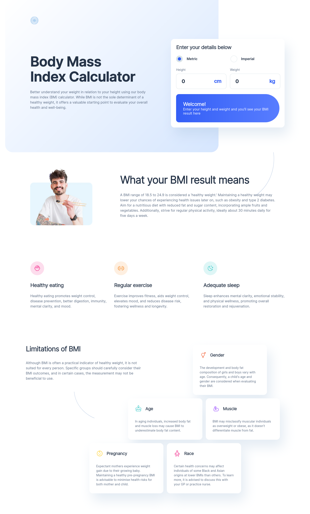

# Frontend Mentor - Body Mass Index Calculator solution

This is a solution to the [Body Mass Index Calculator challenge on Frontend Mentor](https://www.frontendmentor.io/challenges/body-mass-index-calculator-brrBkfSz1T). Frontend Mentor challenges help you improve your coding skills by building realistic projects. 

## Table of contents

- [Overview](#overview)
  - [The challenge](#the-challenge)
  - [Screenshot](#screenshot)
  - [Links](#links)
- [My process](#my-process)
  - [Built with](#built-with)
  - [What I learned](#what-i-learned)
  - [Continued development](#continued-development)
  - [Useful resources](#useful-resources)
- [Author](#author)

## Overview

### The challenge

Users should be able to:

- Select whether they want to use metric or imperial units
- Enter their height and weight
- See their BMI result, with their weight classification and healthy weight range
- View the optimal layout for the interface depending on their device's screen size
- See hover and focus states for all interactive elements on the page

### Screenshot

### Links

- Live Site URL: [Link](https://bmi-calculator-mu-sand.vercel.app/)

## My process

### Built with

- Semantic HTML5 markup
- CSS custom properties
- Flexbox
- CSS Grid
- Mobile-first workflow
- Angular 16
- SCSS

### What I learned

In this project I was able to pratice a lot of my data binding skills and conditional rendering with angular. It had also a great challenge with that grid on the final section, with a very particular layout, not to mention its responsiveness.

### Continued development

Looking forward to refactor my calculator component code, adjusting all the methods and properties to be in its best form, following all the best pratices. Any feedback would be very helpful.

### Useful resources

- [CSS grid generator](https://cssgrid-generator.netlify.app/) - This helped me figuring out how to build that grid in its diverse shapes.

## Author

- Frontend Mentor - [@jAllanOli](https://www.frontendmentor.io/profile/jAllanOli)
- GitHub - [@jAllanOli](https://github.com/jAllanOli)
